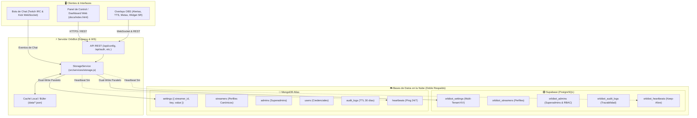
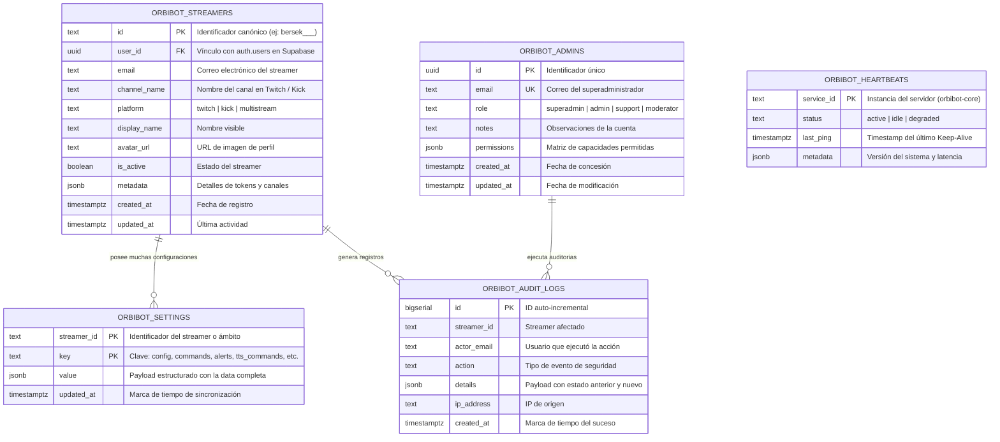
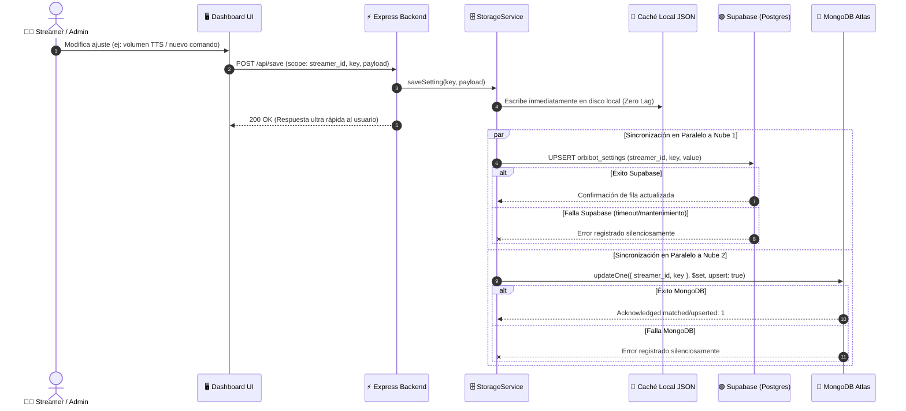
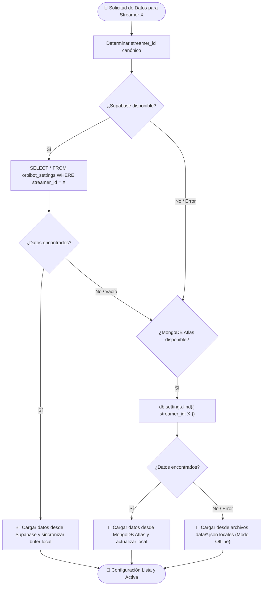
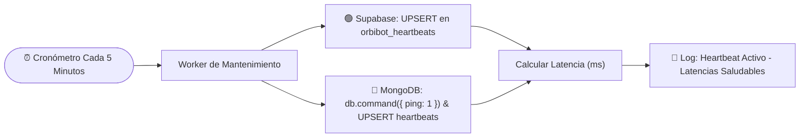

# 🏛️ Arquitectura de Bases de Datos de OrbiBot (Supabase & MongoDB)

Este documento detalla la arquitectura, el esquema relacional y documental, los diagramas entidad-relación y los diagramas de flujo de datos que rigen la persistencia de **OrbiBot**.

---

## 1. Visión General de la Arquitectura

OrbiBot implementa un patrón de **Persistencia Políglota con Doble Respaldo Activo (Dual-Write)**:
- **Base de Datos Principal:** **Supabase (PostgreSQL 15+)** para gestión relacional, autenticación OAuth, políticas de seguridad a nivel de fila (**RLS**) y almacenamiento estructurado `JSONB`.
- **Base de Datos Secundaria:** **MongoDB Atlas (M0/Serverless)** para almacenamiento distribuido de documentos, tolerancia a particiones, respaldo automático y validación mediante `$jsonSchema`.
- **Caché Local de Búfer:** Archivos JSON locales en `data/` para arranque en frío inmediato y funcionamiento offline de emergencia.



---

## 2. Diagrama Entidad-Relación (ERD Multi-Modelo)



---

## 3. Diagramas de Flujo de Datos (Data Flowcharts)

### 3.1. Flujo de Escritura Concurrente (Dual-Write Resiliente)
Cada vez que un streamer edita comandos, voces TTS, alertas o configuraciones en el dashboard:



---

### 3.2. Flujo de Lectura y Resolución Multi-Tenant con Fallback
Al arrancar el servidor o conectar un overlay de OBS:



---

### 3.3. Ciclo Anti-Pausa 24/7 (Keep-Alive Heartbeat)
Tanto Supabase como MongoDB Atlas suspenden las bases de datos inactivas en sus planes comunitarios tras varios días de inactividad. OrbiBot previene esto de forma automatizada:



---

## 4. Estructura de Colecciones en MongoDB Atlas

| Colección | Propósito | Índices Principales | Regla $jsonSchema |
| :--- | :--- | :--- | :--- |
| **`streamers`** | Perfiles canónicos y canales | `{ streamer_id: 1 }` (UNIQUE) | Validación de tipos y campos requeridos |
| **`settings`** | Almacén Multi-Tenant | `{ streamer_id: 1, key: 1 }` (UNIQUE), `{ updated_at: -1 }` | `streamer_id`, `key`, `value` requeridos |
| **`admins`** | Superadministradores del sistema | `{ email: 1 }` (UNIQUE) | Email y rol (`superadmin`, `admin`, etc.) |
| **`users`** | Usuarios registrados | `{ email: 1 }` (UNIQUE) | Email y hash de contraseña |
| **`audit_logs`** | Auditoría de acciones críticas | `{ created_at: 1 }` (TTL: 30 días) | Auto-expiración para proteger cuotas de almacenamiento |
| **`heartbeats`** | Pings de diagnóstico y Anti-Pausa | `{ service_id: 1 }` (UNIQUE) | Timestamp y estado |

---

## 5. Guía de Ejecución y Mantenimiento

### 1. Aplicar Esquema en Supabase (SQL Editor)
Abre tu consola de Supabase:
👉 [https://supabase.com/dashboard/project/pzrlfuzjkwkrnmqkoaue/sql](https://supabase.com/dashboard/project/pzrlfuzjkwkrnmqkoaue/sql)

Copia y pega el contenido completo del archivo:
📄 `database/supabase_schema_v2.sql`

Presiona **"RUN"**. Esto creará:
- Las tablas `orbibot_streamers`, `orbibot_settings`, `orbibot_admins`, `orbibot_audit_logs`, `orbibot_heartbeats`.
- Los índices GIN y B-Tree de alto rendimiento.
- Las políticas de seguridad RLS.
- Las vistas de diagnóstico `v_streamer_health`.

### 2. Aplicar Validadores e Índices en MongoDB Atlas
Ejecuta desde la terminal de tu proyecto:
```bash
node database/mongo_schema_setup.js
```

### 3. Ejecutar Diagnóstico de Salud
Verifica en cualquier momento la latencia y sincronización de ambas nubes:
```bash
node scripts/maintain_databases.js
```
